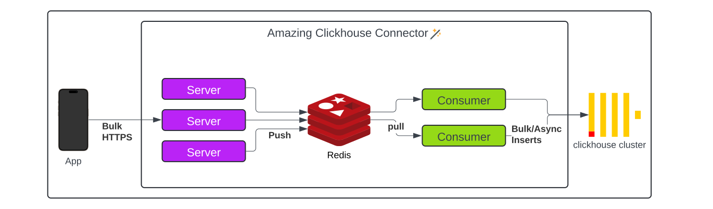

# Amazing clickhouse connector

Tools for receiving metrics from clients through https as json objects, putting them in Redis queue, and finally into ClickHouse.

Built to withstand high throughput by design and for running in Kubernetes.

## Features:
* Multi-thread batching
* Async inserts
* Prometheus monitoring out of the box
* Process table alters automatically if event arrives with new column
* Based on event type filed can put different events it into the corresponding table

## Hot to use it?

Application works in two modes:

server - mode when the app receives metrics and put them into redis queue

consumer - mode when the app consumes redis queue and writes metrics into clickhouse

You can run both with docker-compose and then send events to `/api/v1/s2s/event` endpoint.
One request must contain at least one well-formed json object.
It is also possible to set custom event_type. In this case event will store into corresponding to event_type table ( default by default ).

## Arguments

| Argument                      | Value           | Default                 |
| ------------------------------| --------------- | ----------------------- |
| \-mode                        | server/consumer | \--                     |
| \-threads                     | int             | 10                      |
| \-listen-address              | ip:port         | :6000                   |
| \-monitoring-listen-address   | ip:port         | :6001                   |
| \-redisServer                 | ip:port         | 127.0.0.1:6379          |
| \-clickhouseServer            | ip:port         | 127.0.0.1:9000          |
| \-clickhouseBatchSize         | int             | 100                     |
| \-clickhouseBatchTimeout      | int             | 300                     |
| \-clickhouseAsyncMode         | bool            | false                   |
| \-clickhouseUsername          | string          | default                 |
| \-clickhousePassword          | string          | \--                     |
| \-clickhouseClusterName       | string          | test_cluster_two_shards |
| \-clickhouseDatabaseName      | string          | default                 |

## Hot to run it locally ?

#### Up local test environment
`docker-compose up -d`

#### Check queue size
`docker exec -ti clickhouse-connector-redis-1 redis-cli LLEN "rmq::queue::[clickhouse_connector]::ready"`

#### Check inserts ammount
`docker exec -ti clickhouse-connector-clickhouse1-1 clickhouse-client --query="select COUNT(*) from dist_response_time_base_api"`

ℹ️ Run next command for resolving dependency issue if you install dev environment from scratch:\
`go get -u github.com/ClickHouse/clickhouse-go/v2`\
`go get -u github.com/adjust/rmq/v5`